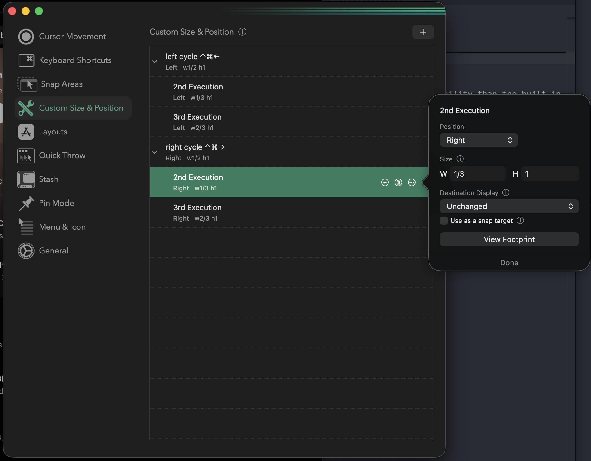

# Computer Setup

Steps and software for setting up a new Mac.

## Apps

### Productivity

- **[Flycut](https://apps.apple.com/us/app/flycut-clipboard-manager/id442160987)** — clipboard manager with history. Access previous clipboard entries via a configurable shortcut (default: `Cmd+Shift+V`).
- **[Rectangle](https://rectangleapp.com/) / [Rectangle Pro](https://rectangleapp.com/pro)** — window management via keyboard shortcuts. Move and resize windows to halves, thirds, corners, and fullscreen without touching the mouse.

  #### Rectangle Pro Setup

  One thing I like to configure is **cycling between window sizes** on a single shortcut. For example, pressing `Ctrl+Cmd+←` cycles the focused window through 1/2, 2/3, and 1/3 of the screen width on the left side — tap it repeatedly to step through sizes without lifting your hands.

  

  Rectangle Pro supports this natively via its cycle actions. You can also set up custom window dimensions beyond the built-in presets — [this blog post](https://medium.com/ryan-hanson/custom-window-dimension-shortcuts-in-macos-e7df347dfd24) is where I discovered how to do that.
- **[RCMD](https://lowtechguys.com/rcmd/)** — app switcher using the right `Cmd` key + a letter to jump directly to any running app. Much faster than Spotlight (`Cmd+Space`) which requires typing the app name and doesn't have dedicated key mappings.

### Terminal

- **[iTerm2](https://iterm2.com/)** — terminal emulator with better split panes, search, and configurability than the built-in Terminal.app.
- **[fish shell](https://fishshell.com/)** — shell with autosuggestions, syntax highlighting, and a good out-of-the-box experience without heavy configuration.
  - Theme: ayu Mirage
  - Prompt: Informative Vcs

### Development

- **[Homebrew](https://brew.sh/)** — package manager for macOS. Install first, everything else follows.

```sh
/bin/bash -c "$(curl -fsSL https://raw.githubusercontent.com/Homebrew/install/HEAD/install.sh)"
```

## macOS System Settings

- **Keyboard repeat rate** — set to fastest repeat, shortest delay (System Settings > Keyboard).
- **Trackpad** — enable Tap to Click, increase tracking speed.
- **Dock** — auto-hide, remove unused apps.
- **Spotlight** — useful for quick app launches but slower than RCMD and lacks direct key mappings.

## Dotfiles

Config files for fish, iTerm2, vim, tmux, and more are tracked in this repo. Symlink or copy as needed.
